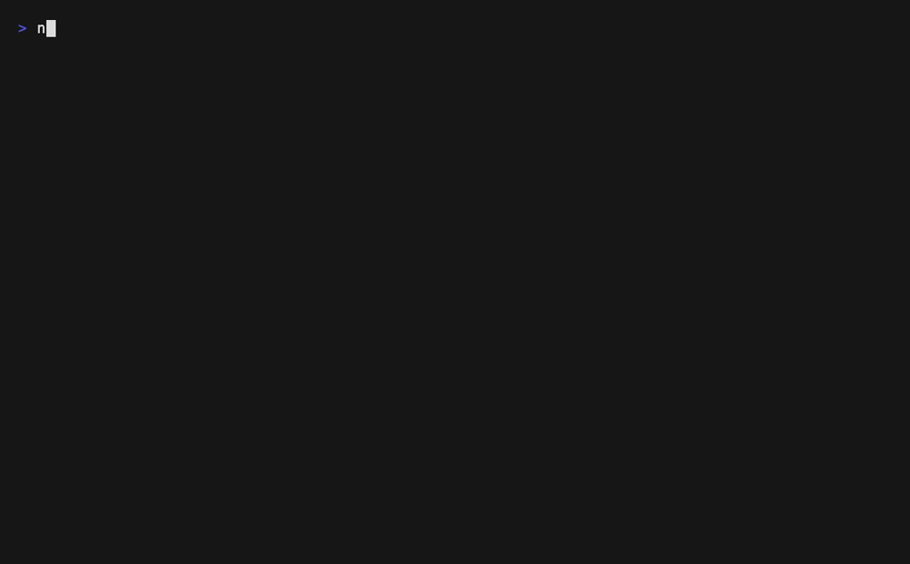
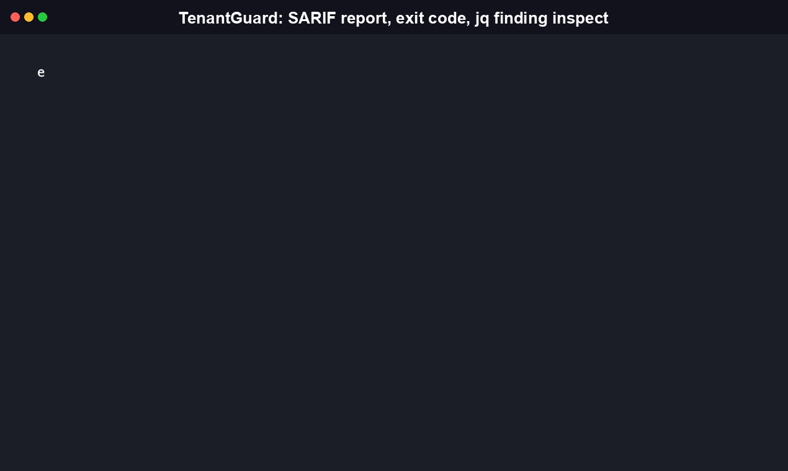

# TenantGuard

**Find the tenant-isolation gap in your self-hosted, multi-tenant AI-agent platform before an auditor, or an attacker, does.**

[](https://github.com/RudrenduPaul/TenantGuard/actions/workflows/ci.yml)
[](https://github.com/RudrenduPaul/TenantGuard/releases/tag/v0.1.1)
[](LICENSE)



## Install

```
npm install -g tenantguard-cli
```

This is the recommended install today. The `tenantguard-cli` npm package now publishes (renamed from the old plain `tenantguard`, which is deprecated); it pulls in the matching platform binary as an npm `optionalDependency` (cosign-verified at publish time, so there's no separate verification step for you) and puts a `tenantguard` command on your `PATH`.

Live platform coverage as of this writing: macOS on Intel and Apple Silicon, Linux on x64 and arm64, and Windows on both x64 and arm64.

```
go install github.com/RudrenduPaul/TenantGuard/cmd/tenantguard@v0.1.1
```

`go install` works on every platform Go supports and doesn't depend on any registry publish state, so it's the fallback if your platform isn't covered above.

You can also skip the top-level package and install a single platform binary package directly:

```
npm install tenantguard-darwin-arm64   # swap for your platform: darwin-x64, linux-x64, linux-arm64, win32-x64, win32-arm64
./node_modules/tenantguard-darwin-arm64/bin/tenantguard scan --demo
```

### Python (pip / uvx)

A PyPI package, `tenantguard-cli`, lives in this repo under `python/` and is built and tested in CI. It downloads and runs the same GitHub Releases binary the npm packages use, verifying the release's SHA-256 `checksums.txt` on first run (itself Sigstore-signature-verified before any digest inside it is trusted) and caching the verified binary locally after that. That's a different trust boundary than the npm packages, which embed a cosign-verified binary at publish time and need no runtime download at all; the PyPI wrapper's checksum check is the equivalent guarantee for a path that has to fetch the binary on the end user's machine instead.

PyPI versions up to and including 0.1.2 shipped a bug that made `pip install tenantguard-cli` succeed but `tenantguard scan --demo` fail on first run with `could not parse checksums.txt.pem as a PEM certificate` (the wrapper wasn't base64-decoding the cosign-produced certificate/signature release assets before parsing them). That is fixed in `tenantguard-cli` 0.1.3, published to PyPI on 2026-08-03; `pip install tenantguard-cli` now installs a working tool with no extra steps.

## Table of Contents

- [Features](#features)
- [Quickstart](#quickstart)
- [CLI Reference](#cli-reference)
- [MCP server (agent-native usage)](#mcp-server-agent-native-usage)
- [How TenantGuard compares](#how-tenantguard-compares)
- [What is TenantGuard and why does it exist](#what-is-tenantguard-and-why-does-it-exist)
- [FAQ](#faq)
- [Contributing](#contributing)
- [License](#license)

## Features

TenantGuard scans a self-hosted, multi-tenant AI-agent deployment's configuration against 16 rules, each derived from a real, confirmed tenant-isolation failure mode. Every rule is fail-closed: an undeclared or ambiguous setting is a violation, not a silent pass.

### Tenant isolation boundaries

| Rule | What it catches |
|---|---|
| **TA01** | A sandbox/workspace mount is a violation unless its path carries the `${TENANT_ID}` scoping placeholder or `scoped_per_tenant` is explicitly declared true. Maps to goclaw#1163. |
| **TA03** | A cron binding's `target_agent` must belong to the tenant that declared the binding; a dangling or cross-tenant reference fails closed. Maps to goclaw#1217. |
| **TA11** | Flags two `channel_instances` entries that share the same `device_session_id` but declare different tenants (e.g. a shared WhatsApp device row). Maps to goclaw#1064/#1065. |
| **TA14** | A per-agent resource profile (browser/container) is a violation unless its path contains the `${TENANT_ID}` placeholder. Maps to goclaw#778. |
| **TA15** | Flags a `channel_instances` entry that doesn't explicitly declare `reload_strategy: differential`; an undeclared value or `full` both mean any single create/update/delete on that entry triggers a destructive full stop/restart of every running channel instance across every tenant. Trusts the deployment's own declaration (TenantGuard cannot verify the real loader actually diffs by fingerprint). Maps to goclaw#1147. |

### Network and credential exposure

| Rule | What it catches |
|---|---|
| **TA02** | Flags a saved MCP tool URL targeting a private/loopback/reserved address, using real `net.cidr_contains` on a literal or DNS-resolved IP (not string matching), unless the deployment declares both `validates_private` and `pins_resolved_ip` (or the host is explicitly allowlisted). Documents the DNS-rebinding/TOCTOU limitation explicitly. Maps to goclaw#1070. |
| **TA04** | Flags an exec tool that denies direct env-dump reads but not indirect reads (e.g. `jq $ENV`), and independently flags any tool with `allow_chain_exec: true`, since credential env vars leak to every command in a shell operator chain. Maps to goclaw#1227 and goclaw#1033. |
| **TA08** | A provider config is a violation unless it declares a recognized strong-encryption algorithm (currently only `aes-256-gcm`) for stored OAuth/credential tokens. Maps to goclaw#65. |
| **TA16** | Flags a provider (e.g. litellm, bifrost) connection URL targeting a private/loopback/reserved address, using the same `net.cidr_contains`-based logic TA02 applies to MCP tools, unless the deployment declares both `validates_private` and `pins_resolved_ip` (or the host is explicitly allowlisted). Maps to goclaw#1430. |

### Execution and approval hardening

| Rule | What it catches |
|---|---|
| **TA05** | An "allow-always" exec approval keyed on basename alone, not a full path, is a violation, since it can be reused against a different executable sharing that basename. Maps to goclaw#1216. |
| **TA07** | Flags root-by-default execution, full host-environment passthrough, tmpfs mounts missing `noexec`/`nosuid`/`nodev`, or any dangerous Linux capability added (`SETUID`, `SETGID`, `CHOWN`, `SYS_ADMIN`, `DAC_OVERRIDE`, `NET_ADMIN`, `SYS_PTRACE`). Maps to goclaw#1014, #1015, #524. |
| **TA09** | A deployment must explicitly declare `sandbox.on_unavailable: fail_closed`; an undeclared value is treated as a violation, not a silent pass. Maps to goclaw#246. |

### Identity, audit, and recovery

| Rule | What it catches |
|---|---|
| **TA06** | A cron binding whose config doesn't declare `captures_creator_identity` is a violation; without it, a group-context job fires under a `system` identity instead of the real human creator. Maps to goclaw#1129. |
| **TA12** | Deployment-level check: a violation if `owner_ids` is empty or no recovery/reset command is declared, risking permanent operator lockout. Maps to goclaw#954. |
| **TA13** | Deployment-level check: a violation if `bridge_hmac_enabled` or `bridge_context_headers_signed` is not declared true; a missing declaration defaults to unsigned and fails, never silently passes. Maps to goclaw#91. |
| **TA10** | Best-effort, static-config proxy: flags an agent whose entry doesn't explicitly declare `has_workspace_restriction_override` or `has_sandbox_config_override`. Maps to goclaw#145. |

Other verified capabilities:

- **SARIF 2.1.0 output** (`--format sarif`), schema-valid, with real byte/line locations and messages, ready for `github/codeql-action/upload-sarif` and GitHub code scanning.
- **Plain JSON output** (`--format json`), a schema-light alternative to SARIF for a script or agent that just wants raw `rule_id`/`status`/`file`/`line` results without SARIF's tool/run/rule/taxonomy object model. Unlike SARIF (which only reports FAIL as a "result"), the JSON mode includes every PASS too, plus a `summary.fail`/`summary.pass` count. **Merged to `main`, not yet in a tagged release.** See the note under [CLI Reference](#cli-reference).
- **Provisional HIPAA citations** on every finding (`--control hipaa`), mapped per rule, marked provisional (see [FAQ](#faq)).
- **Zero-setup demo mode** (`--demo`) that scans a bundled synthetic deployment, no target config required.
- **GitHub Action** (`action/action.yml`) that installs a pinned version via `go install` and uploads the SARIF report automatically.
- **MCP server mode** (`tenantguard mcp`) that exposes the same scan engine as a tool an AI agent can call directly over stdio, instead of only through a human typing `tenantguard scan`. **Merged to `main`, not yet in a tagged release.** See [MCP server (agent-native usage)](#mcp-server-agent-native-usage) below for what's needed to run it today.

## Quickstart

```
tenantguard scan --demo
```

Real captured output:

```
TenantGuard: Tenant-Isolation Audit
Target: /var/folders/m0/5tzdd47n6znb166d4w3m2q0c0000gn/T/tenantguard-demo-488625596

[FAIL]  TA01 sandbox/workspace mount path is not scoped per-tenant (no ${TENANT_ID} placeholder and no explicit scoped_per_tenant declaration)
  .../deployment.yaml:12
  Maps to: goclaw#1163 | HIPAA Sec164.312(a)(1) Access Control (provisional)

[FAIL]  TA02 MCP tool URL targets a private/loopback/reserved address (via real CIDR containment on a literal or DNS-resolved IP) without a verified, IP-pinned SSRF validator or an explicit host allowlist entry. CAVEAT: a PASS trusts the deployment's own pins_resolved_ip/validates_private declaration -- TenantGuard cannot verify the real validator actually pins the resolved IP for the connection itself, so DNS-rebinding/TOCTOU risk persists if that declaration is inaccurate
  .../deployment.yaml:22
  Maps to: goclaw#1070 | HIPAA Sec164.312(e)(1) Transmission Security (provisional)

[FAIL]  TA03 cron binding's target agent does not belong to the declaring tenant
  .../deployment.yaml:35
  Maps to: goclaw#1217 | HIPAA Sec164.312(a)(1) Access Control (provisional)

[FAIL]  TA04 exec tool denies direct env dump but not indirect env reads (e.g. jq $ENV), or allows credential-chain leakage via allow_chain_exec (goclaw#1033)
  .../deployment.yaml:25
  Maps to: goclaw#1227 | HIPAA Sec164.312(a)(2)(iv) Encryption/Decryption (provisional)

[FAIL]  TA05 exec-approval allow-always entry is keyed on basename only, not a full path scope
  .../deployment.yaml:30
  Maps to: goclaw#1216 | HIPAA Sec164.312(a)(1) Access Control (provisional)

[FAIL]  TA09 sandbox fail-closed posture not declared (sandbox.on_unavailable must be "fail_closed")
  .../tenantguard-demo-488625596:0
  Maps to: goclaw#246 | HIPAA Sec164.312(a)(1) Access Control (provisional)

[FAIL]  TA10 agent does not explicitly declare a per-agent config override (workspace restriction or sandbox config), risking silent inheritance of an undeclared global default
  .../deployment.yaml:40
  Maps to: goclaw#145 | HIPAA Sec164.312(a)(1) Access Control (provisional)

[FAIL]  TA13 MCP/CLI bridge does not declare HMAC-signed context headers (bridge.hmac_enabled and bridge.context_headers_signed)
  .../tenantguard-demo-488625596:0
  Maps to: goclaw#91 | HIPAA Sec164.312(e)(1) Transmission Security (provisional)

[FAIL]  TA06 cron binding does not declare that its store layer captures/replays the human creator's sender identity at fire time
  .../deployment.yaml:35
  Maps to: goclaw#1129 | HIPAA Sec164.312(b) Audit Controls (provisional)

[FAIL]  TA07 sandbox container privilege is not hardened (root user by default, full host-env passthrough, tmpfs missing noexec/nosuid/nodev, or a dangerous Linux capability added)
  .../deployment.yaml:12
  Maps to: goclaw#1014 | HIPAA Sec164.312(a)(1) Access Control (provisional)

[FAIL]  TA11 channel/session device identity is shared across channel_instances declaring different tenants
  .../deployment.yaml:54
  Maps to: goclaw#1064 | HIPAA Sec164.312(a)(1) Access Control (provisional)

[FAIL]  TA11 channel/session device identity is shared across channel_instances declaring different tenants
  .../deployment.yaml:57
  Maps to: goclaw#1064 | HIPAA Sec164.312(a)(1) Access Control (provisional)

[FAIL]  TA15 channel_instances entry does not declare reload_strategy: differential, so any single create/update/delete on that entry triggers a full stop/restart of every running channel instance across all tenants (no per-instance fingerprint/diff step). CAVEAT: a PASS trusts the deployment's own reload_strategy declaration -- TenantGuard cannot verify the real InstanceLoader actually performs a differential (fingerprint-diffed) reload rather than the destructive full rebuild, so a mismatched declaration would still scan clean
  .../deployment.yaml:54
  Maps to: goclaw#1147 | HIPAA Sec164.312(a)(1) Access Control (provisional)

[FAIL]  TA15 channel_instances entry does not declare reload_strategy: differential, so any single create/update/delete on that entry triggers a full stop/restart of every running channel instance across all tenants (no per-instance fingerprint/diff step). CAVEAT: a PASS trusts the deployment's own reload_strategy declaration -- TenantGuard cannot verify the real InstanceLoader actually performs a differential (fingerprint-diffed) reload rather than the destructive full rebuild, so a mismatched declaration would still scan clean
  .../deployment.yaml:57
  Maps to: goclaw#1147 | HIPAA Sec164.312(a)(1) Access Control (provisional)

[PASS]  1 check(s) clear

Summary: 14 FAIL, 1 PASS
Findings map to confirmed open goclaw issues where applicable. HIPAA citations are provisional, see README.
```

The bundled fixture is deliberately noisy: it exists to exercise nearly every rule at once. TA08 (credential-storage encryption) and TA14 (per-agent resource-profile isolation) are per-entry checks that only fire against `providers` and `resource_profiles` entries in the scanned config, and this fixture declares zero entries of either kind, so both rules have nothing to evaluate and produce no finding at all, neither PASS nor FAIL. TA16 (provider connection SSRF) is the same kind of per-entry check against `providers` entries, so it also produces nothing on this fixture. The one line shown as passing, "1 check(s) clear," is TA12 (owner/sysadmin recovery), which the fixture's `owner_ids` and `has_recovery_command` values are deliberately set to satisfy. Exit code is `1`, since findings are present; see [CLI Reference](#cli-reference) for the full exit-code contract.

Scan a real deployment and emit SARIF for code scanning instead:

```
tenantguard scan --target ./deployment --format sarif --sarif-out tenantguard-report.sarif
```



Or emit plain JSON, for a script or agent that would rather parse a flat findings array than a SARIF document:

```
tenantguard scan --target ./deployment --format json
```

## CLI Reference

TenantGuard has two subcommands: `scan` (the audit itself) and `mcp` (runs the same scan engine as an MCP server over stdio, see [MCP server (agent-native usage)](#mcp-server-agent-native-usage)). There is no top-level `--help` or `--version` flag; running `tenantguard` with no arguments, `tenantguard --help`, or any first argument other than `scan` or `mcp` prints the usage lines below to stderr and exits `2`.

> **Release status:** `--format json` and the `mcp` subcommand shown below are implemented on `main` but are **not yet in the latest tagged release (`v0.1.1`)**. The version installed today via `npm install -g tenantguard-cli`, `pip install tenantguard-cli`, and `go install .../cmd/tenantguard@v0.1.1` all resolve to that same `v0.1.1` binary and only support `--format terminal|sarif`. To use `--format json` or `tenantguard mcp` right now, build from source instead: `go install github.com/RudrenduPaul/TenantGuard/cmd/tenantguard@main`. Both will ship in the next tagged release; this note will be removed once that release is cut.

```
usage: tenantguard scan [--target DIR | --demo] [--format terminal|sarif|json] [--control hipaa]
       tenantguard mcp
```

`tenantguard scan --help` output:

```
Usage of scan:
  -control string
    	compliance framework to cite (hipaa)
  -demo
    	scan a bundled synthetic deployment instead of --target (zero setup)
  -format string
    	output format: terminal, sarif, or json (default "terminal")
  -sarif-out string
    	file to write SARIF output to when --format=sarif (default "tenantguard-report.sarif")
  -target string
    	path to the deployment config directory to scan
```

Exit codes (defined in `cmd/tenantguard/main.go`):

| Code | Meaning |
|---|---|
| `0` | Clean scan, no findings |
| `1` | Scan ran successfully, findings present |
| `2` | Scan or usage error |

## MCP server (agent-native usage)

> **Not yet in a tagged release.** Everything in this section describes `main` branch behavior. Run `go install github.com/RudrenduPaul/TenantGuard/cmd/tenantguard@main` to get the `mcp` subcommand today; the `v0.1.1` binary installed via the npm/pip/`go install@v0.1.1` paths in [Install](#install) does not have it yet and will print a usage error if you try.

Everything above assumes a human typing `tenantguard scan` at a terminal. TenantGuard also runs as an MCP server, so an AI agent (a coding assistant, an ops agent, anything that speaks the Model Context Protocol) can call the scan engine directly as a tool call, instead of shelling out to the CLI and parsing text.

```
tenantguard mcp
```

This starts an MCP server on stdio and blocks until the client disconnects, the same way any other stdio-based MCP server runs under its client's process supervision. It takes no flags or positional arguments. Under the hood it's a thin protocol adapter (`internal/mcpserver`) over the exact same `internal/collector` -> `internal/policy` -> `internal/compliance` -> `internal/report` pipeline the CLI's `scan` subcommand runs; there's no separate rule-evaluation logic to keep in sync.

It exposes a single tool, `scan`, with three arguments that mirror the CLI's own flags:

| Argument | Maps to | Notes |
|---|---|---|
| `target` | `--target` | Required. Path to the deployment config directory to scan. |
| `format` | `--format` | Optional. `json`, `sarif`, or `terminal`. Defaults to `json` for MCP (the CLI itself defaults to `terminal`), since a calling agent almost always wants structured output, not a human-formatted report. |
| `control` | `--control` | Optional. Only `hipaa` is recognized today; an empty value also defaults to `hipaa`, matching the CLI. |

For `json` and `sarif` output, the result is returned both as text and as MCP `StructuredContent`, so a client that wants to read fields directly (`rule_id`, `status`, `file`, `line`) doesn't have to re-parse the text block itself. Tool-level failures (a bad target path, a policy load error) come back as a normal MCP error result, not a protocol-level failure, so a calling agent can handle "scan failed" the same way it handles any other failed tool call.

To register TenantGuard with an MCP-compatible client such as Claude Desktop, add it to the client's server config:

```json
{
  "mcpServers": {
    "tenantguard": {
      "command": "tenantguard",
      "args": ["mcp"]
    }
  }
}
```

This assumes `tenantguard` is already on your `PATH` (see [Install](#install)). If you installed it somewhere else, replace `"command"` with the full path to the binary.

Before this shipped, the only way to run a scan was a human invoking the CLI directly. With `tenantguard mcp`, an agent can call `scan` as a tool, get structured findings back, and act on them in the same session, without a person reading terminal output and typing the next command by hand.

## How TenantGuard compares

| Tool | Focus | Multi-tenant AI-agent aware | SARIF output | Rule count | Project maturity |
|---|---|---|---|---|---|
| **TenantGuard** | Tenant-isolation config auditing for self-hosted multi-agent platforms | Yes, purpose-built for this one surface | Yes, verified (SARIF 2.1.0) | 16, all scoped to tenant isolation | v0.1.1, two tagged releases |
| [Checkov](https://github.com/bridgecrewio/checkov) | General-purpose IaC/cloud misconfiguration scanner (Terraform, CloudFormation, Kubernetes, Dockerfile, and more) | No, README makes no reference to multi-tenant AI-agent platforms or tenant-isolation checks | Yes, verified (`-o sarif`) | 1,000+, general cloud/IaC policies | 8.9k GitHub stars, long-established, actively maintained |
| [Conftest](https://github.com/open-policy-agent/conftest) | Reference OPA/Rego policy-testing tool for structured config data (18+ input formats) | No, the generic Rego test harness other tools build policy packs on top of; no built-in tenant-isolation or AI-agent rule pack | Yes, verified (`-o sarif`, SARIF 2.1.0) | 0 built-in (a policy-testing engine, not a rule pack) | Long-established reference OPA project, actively maintained |
| [PolicyGuard](https://github.com/ToluGIT/policyguard) | Terraform/OpenTofu AWS/Azure misconfiguration scanner (Go + OPA/Rego, Cobra CLI, sandboxed OPA engine) | No, narrowly scoped to Terraform/OpenTofu AWS/Azure resources; no mention of multi-tenant systems or AI-agent platforms | Yes, verified (SARIF 2.1.0 with stable fingerprints + CWE tags) | 15+ AWS/Azure resource checks | 1 star, 2 forks, 4 releases (v0.3.1) |
| [AgentShield](https://github.com/affaan-m/agentshield) | AI-agent security scanner (secrets, permissions, hooks, MCP server security, agent-config review) | No, explicitly scoped to a single Claude Code user's local `.claude/` directory (single-user/team dev environment), not multi-tenant SaaS isolation | Yes, verified (`--format sarif`, SARIF 2.1.0) | 102, across 5 categories | 1,000+ GitHub stars, actively maintained (started at a Feb 2026 hackathon) |

TenantGuard trades breadth for depth: 16 rules is a fraction of Checkov's 1,000+, and TenantGuard is two tagged releases old against Checkov, Conftest, and PolicyGuard's much longer track records. What TenantGuard has that none of the others do is a rule pack purpose-built for cross-tenant isolation in self-hosted AI-agent deployments, a surface none of the general-purpose IaC scanners cover and even AgentShield, the closest domain match, stops short of: it audits a single developer's local config, not cross-tenant isolation in a self-hosted, multi-tenant deployment. That is the niche TenantGuard targets, narrowly and on purpose.

Precision/recall benchmarks for TenantGuard's own rule set against labeled fixtures are not yet published; where a competitor above reports a number (e.g. PolicyGuard's precision/recall), figures are quoted from that project's own README, not independently re-verified here.

## What is TenantGuard and why does it exist

TenantGuard is a command-line policy-as-code scanner, written in Go and built on OPA/Rego, that audits a self-hosted multi-tenant AI-agent platform's configuration for tenant-isolation defects: the class of bug where one tenant's agent, sandbox, cron job, or credential can reach or affect another tenant.

TenantGuard exists because a real, confirmed multi-tenant AI-agent platform (goclaw) has had multiple open, unresolved issues in exactly this category, including a sandbox mount not scoped per tenant, a cross-agent authorization gap, an exec tool that leaks secrets through an indirect path, an approval bypass keyed on a filename instead of a real path scope, and an SSRF validation mismatch on saved tool URLs and LLM provider connections. No existing general-purpose IaC scanner (Checkov, Conftest, PolicyGuard) or AI-agent security scanner (AgentShield) checks for this specific failure category: cross-tenant isolation in a self-hosted, multi-agent deployment. TenantGuard fills that gap with 16 fail-closed rules, each traceable to a real, cited issue.

TenantGuard is not a generic Terraform/Kubernetes scanner and does not replace Checkov or Conftest for general cloud-infrastructure misconfiguration. It is scoped specifically to the tenant-isolation surface of self-hosted multi-tenant agent deployments.

## FAQ

**How is TenantGuard different from a generic IaC scanner like Checkov or Conftest?**
Checkov and Conftest scan general infrastructure-as-code (Terraform, Kubernetes, CloudFormation, and similar) for broad categories of misconfiguration. Neither ships a rule pack for multi-tenant AI-agent deployments. TenantGuard's 16 rules are purpose-built for that one surface: sandbox mounts, cron/agent bindings, MCP tool registrations, LLM provider connections, exec approvals, and channel/session identity, each derived from a real, cited defect.

**Does TenantGuard replace OPA or Conftest?**
No. TenantGuard's rules are written in Rego and TenantGuard bundles its own evaluation path; it is a purpose-built policy pack and CLI, not a general-purpose Rego test harness. If you need to test arbitrary structured config against arbitrary Rego policies, Conftest is the right general tool. TenantGuard is the right tool specifically for tenant-isolation checks on a multi-agent deployment.

**What does the HIPAA citation on each finding mean?**
Every finding is annotated with a related HIPAA Security Rule citation (e.g. Sec164.312(a)(1) Access Control) to help map a technical finding to a compliance control a reviewer may already track. These citations are marked **provisional**: they indicate a plausible mapping between the technical control and the cited HIPAA section, not a legal or audited compliance determination. Treat them as a starting point for your own compliance review, not a substitute for one.

**Does a PASS on TA02 (SSRF) mean the MCP tool URL is actually safe from DNS rebinding?**
Not fully. TA02 uses real CIDR containment against a literal or DNS-resolved IP, not string matching, but a PASS trusts the deployment's own `pins_resolved_ip`/`validates_private` declaration. TenantGuard cannot independently verify that the real validator pins the resolved IP for the actual connection, so a DNS-rebinding/TOCTOU risk persists if that declaration is inaccurate. This limitation is documented directly in the TA02 rule.

**Can I scan a real deployment instead of the bundled demo?**
Yes: `tenantguard scan --target <path-to-deployment-config-dir>`. `--demo` exists so you can see the tool run with zero setup before pointing it at a real config.

**Does TenantGuard produce output a CI pipeline or GitHub code scanning can consume?**
Yes. `--format sarif --sarif-out <file>` produces a schema-valid SARIF 2.1.0 document with real result locations and messages. The bundled GitHub Action (`action/action.yml`) runs a scan and uploads the SARIF report via `github/codeql-action/upload-sarif` in one step.

**Why does TenantGuard have both `--format sarif` and `--format json`? Isn't SARIF already structured output?**
Yes, SARIF is a real, standard, machine-parseable format, and it is the right choice for CI/code-scanning integration. `--format json` exists for a different consumer: a script or agent that wants to parse `rule_id`/`status`/`file`/`line` directly, without walking SARIF's tool/run/rule/taxonomy object model first. It also reports every PASS alongside every FAIL, which SARIF deliberately does not (SARIF results represent problems found, not a full checklist), so a caller can answer "what did you check" and not just "what did you flag" from one document. Note: `--format json` is on `main`, not yet in the `v0.1.1` tagged release the npm/pip packages install today. See the note under [CLI Reference](#cli-reference).

**What do the CLI exit codes mean?**
`0` is a clean scan with no findings, `1` means the scan ran successfully and found violations, and `2` is a scan or usage error (including running `tenantguard` with no subcommand, or any subcommand other than `scan` or `mcp`).

**Is there an npm package?**
Yes, `npm install -g tenantguard-cli` is live and is the recommended install path (renamed from the old plain `tenantguard`, which is deprecated). It depends on a matching platform binary package as an npm `optionalDependency`; all six platform packages are live (macOS x64/arm64, Linux x64/arm64, Windows x64/arm64). See [Install](#install) above.

**Is there a PyPI package?**
Yes, `tenantguard-cli` is live on PyPI (source under `python/`, built and tested in CI). Versions up to and including 0.1.2 had a first-run bug that is fixed in 0.1.3 (see [Install](#install) above); `pip install tenantguard-cli` now works out of the box.

**Can an AI agent run TenantGuard directly, without a human typing CLI commands?**
Yes, via `tenantguard mcp`, which starts an MCP server on stdio exposing the scan engine as a `scan` tool. See [MCP server (agent-native usage)](#mcp-server-agent-native-usage) above for the exact client config and tool arguments, and for the note on which install path has this today.

**Is TenantGuard a library I can import into my own Go program?**
No, not currently. Everything outside `cmd/tenantguard` (the collector, compliance mapping, demo fixture, policy engine, and report formatting) lives under `internal/`, which Go's own tooling makes non-importable from outside this module. TenantGuard is distributed as a CLI binary and a GitHub Action, not an importable Go package.

**Can I use TenantGuard in a commercial or closed-source product?**
Yes. TenantGuard is licensed under the Apache License 2.0, which permits commercial use, modification, private use, and redistribution, including inside a proprietary or SaaS product, subject to the license's standard notice and attribution terms (retaining the copyright notice and a copy of the license, and marking any modified files). It comes with no warranty, as stated in the license. See [LICENSE](LICENSE) for the full, authoritative terms.

## Contributing

Contributions are welcome. See [CONTRIBUTING.md](CONTRIBUTING.md) for how to add a new rule; every rule needs both a vulnerable and a clean fixture before it ships.

## License

Apache License 2.0. See [LICENSE](LICENSE).
